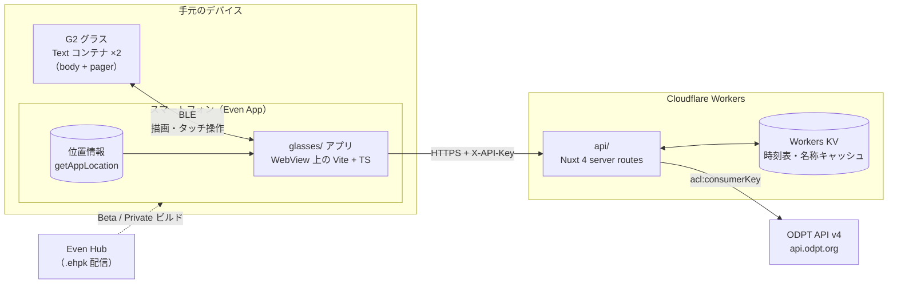
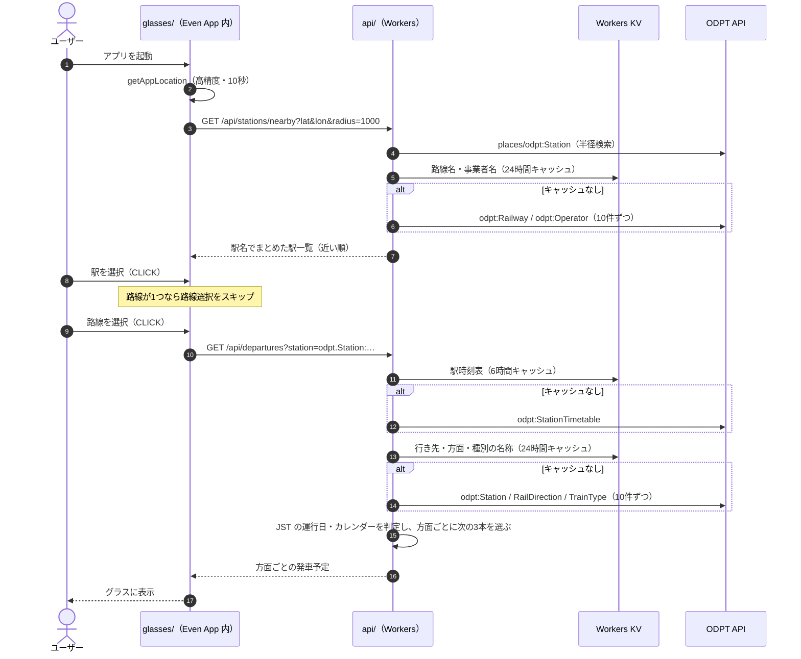
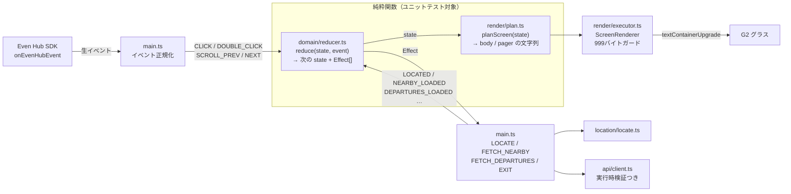
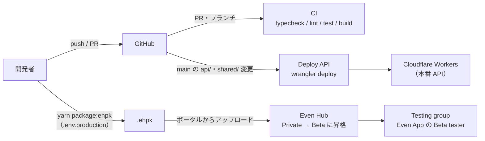

# 次の電車 (departure)

Even Realities G2 向けの「最寄り駅から次に発車する電車」をすぐ確認するアプリ。
[公共交通オープンデータ（ODPT）](https://developer.odpt.org/) の駅・駅時刻表データを使う（出典とライセンスは[「データの出典とライセンス」](#データの出典とライセンス)を参照）。
構成は [even-hatena-reader](https://github.com/andoshin11/even-hatena-reader) を踏襲している。

| ディレクトリ | 内容 |
| --- | --- |
| [`glasses/`](glasses/README.md) | G2 アプリ本体（Vite + TypeScript + `@evenrealities/even_hub_sdk`） |
| [`api/`](api/README.md) | ODPT を中継する API（Nuxt 4 server routes → Cloudflare Workers）。ODPT のアクセストークンをアプリに埋め込まないためのもの |
| `shared/` | api と glasses の間の契約（レスポンス型・定数） |

## 画面

```
駅一覧 --CLICK--> 路線一覧 --CLICK--> 発車予定
  |       (路線が1つならスキップ)          |
  +<---------- DOUBLE_CLICK ---------------+
```

1. **駅一覧**: Even App（スマートフォン）の現在地から半径 1km 以内の駅を近い順に表示。ODPT の駅は路線ごとなので、同じ駅名はまとめる。
2. **路線一覧**: 選んだ駅に乗り入れている路線。1路線しかなければこの画面は出ない。
3. **発車予定**: 方面ごとに、次に発車する列車を最大3本（時刻・種別・行き先）。CLICK で最新に更新。

## アーキテクチャ

### 全体構成



- **アプリはスマートフォンの WebView で動き、グラスは表示と入力だけを担う**。描画は Even Hub SDK の bridge 経由で、グラス上の Text コンテナに文字列を送るだけ。
- **ODPT のアクセストークンはアプリに持たせない**。`.ehpk` は解析すれば中身を取り出せるため、ODPT へのアクセスは必ず `api/` を経由させ、トークンは Worker secret にだけ置く。アプリと `api/` の間は `X-API-Key` による簡易認証。
- **`api/` は ODPT の JSON-LD を G2 で表示しやすい形に整形する**。路線ごとの駅を駅名でまとめる、方面ごとに次の3本を選ぶ、ID を日本語名に解決する、といった処理をサーバー側で済ませ、アプリには表示に必要な最小限の JSON だけを返す。

### 起動から発車予定の表示まで



- **「次の電車」の計算はリクエストごとにサーバーの時計（JST）で行う**。時刻表と名称はキャッシュするが、レスポンス自体は現在時刻に依存するのでキャッシュしない。
- **運行日の境界は JST 03:00**。0時台の終電は前日のダイヤとして扱い、終電後は翌運行日の始発から補う。
- **カレンダーは「限定的なものから順に」選ぶ**。事業者によって「平日 / 土曜 / 休日」と「平日 / 土休日」の分け方が混在するため、運行日ごとに候補を並べ、方面ごとに最初に見つかった時刻表を使う（祝日は `@holiday-jp/holiday_jp`）。
- **ODPT の `owl:sameAs` の複数指定は1リクエスト10件まで**（11件以上は 400）。名称の一括取得は10件ずつに分けている。

### glasses/ の内部構造



- **状態遷移と描画内容の計算は純粋関数**（`reduce` / `planScreen`）。SDK 呼び出しと通信は `main.ts` の effect runner に閉じ込め、1つの Promise チェーンで直列化している。
- **List コンテナは使わず、Text コンテナ2つ（body + pager）と自前のカーソル（`▶`）で一覧を描く**。SDK 0.0.16 の List は初期選択位置を指定できず、作り直すたびに選択が先頭に戻るため（even-hatena-reader と同じ方式）。
- **Text コンテナの上限（UTF-8 で 999 バイト）を描画前に必ずチェックする**。発車予定で方面が多く収まらない場合は、収まる方面までを表示して「他N方面は表示しきれません」と明示する。

### ビルドと配信



- **`api/` は main への push で自動デプロイ**。デプロイ用の API トークンは Workers Scripts: Edit のみ。
- **`glasses/` は `.ehpk` にパッケージしてポータルからアップロードする**。アップロード直後は Private ビルドで、Beta に昇格させると Testing group のメンバーが Even App の「Beta tester」からインストールできる。
- 開発中はシミュレーター（現在地は `VITE_DEV_FIXED_LOCATION` で固定）か、`yarn dev --mode device` + `evenhub qr` で実機に読み込んで確認する。

## セットアップ

```bash
corepack enable
yarn install

# api: ODPT のアクセストークン等を設定して起動（詳細は api/README.md）
cp api/.env.example api/.env
yarn workspace @departure/api dev

# glasses: 別ターミナルで（詳細は glasses/README.md）
cp glasses/.env.example glasses/.env
yarn workspace @departure/glasses dev
yarn workspace @departure/glasses simulator
```

Node.js は `.nvmrc`（24）を使う。

## データの出典とライセンス

このアプリおよびこのリポジトリの成果物（ドキュメント・図・スクリーンショット等を含む）は、[公共交通オープンデータセンター](https://www.odpt.org/)において提供される公共交通データを利用しています。

公共交通事業者により提供されたデータを元にしていますが、必ずしも正確・完全なものとは限りません。本アプリの表示内容について、公共交通事業者への直接の問い合わせは行わないでください。

### 利用しているデータとライセンス

| 提供者 | データセット | ライセンス |
| --- | --- | --- |
| 東京地下鉄株式会社（東京メトロ） | [駅情報](https://ckan.odpt.org/dataset/r_station-tokyometro)、[駅時刻表](https://ckan.odpt.org/dataset/r_station_timetable-tokyometro)、[路線系統情報](https://ckan.odpt.org/dataset/r_route-tokyometro) | [公共交通オープンデータ基本ライセンス](https://developer.odpt.org/terms/data_basic_license.html) |
| 東京都交通局（都営） | [駅情報](https://ckan.odpt.org/dataset/r_station-toei)、[駅時刻表](https://ckan.odpt.org/dataset/r_station_timetable-toei)、[路線系統情報](https://ckan.odpt.org/dataset/r_route-toei) | [クリエイティブ・コモンズ・ライセンス 表示 4.0 国際（CC BY 4.0）](https://creativecommons.org/licenses/by/4.0/deed.ja) |

東京都交通局のデータについてのクレジット表記（このアプリは時刻表から次の発車予定を選んで表示するため、改変して利用しています）:

> このアプリは、以下の著作物を改変して利用しています。
> 東京都交通局・公共交通オープンデータ協議会、東京都交通局 駅情報・駅時刻表・路線系統情報、クリエイティブ・コモンズ・ライセンス　表示4.0国際（https://creativecommons.org/licenses/by/4.0/deed.ja）

### 遵守している規約

- [公共交通オープンデータセンター利用規約](https://developer.odpt.org/terms/center_use_rules.html)
- [公共交通オープンデータ基本ライセンス](https://developer.odpt.org/terms/data_basic_license.html)
- [公共交通オープンデータ開発者ガイドライン](https://developer.odpt.org/terms/data_basic_use_guideline.html)

### このリポジトリでの扱い

- このリポジトリには ODPT から取得したデータを含めていません（テストで使うデータは架空のものです）。データは `api/` が実行時に取得し、アプリの表示のためだけにキャッシュします。
- ODPT のアクセストークンはリポジトリにもアプリ（`.ehpk`）にも含めず、`api/` の実行環境（Cloudflare Workers の secret）にだけ置いています。
- このアプリについての記事・スクリーンショット等を公開する場合も、上記の出典とクレジットを記載してください（開発者ガイドライン 3.2）。

